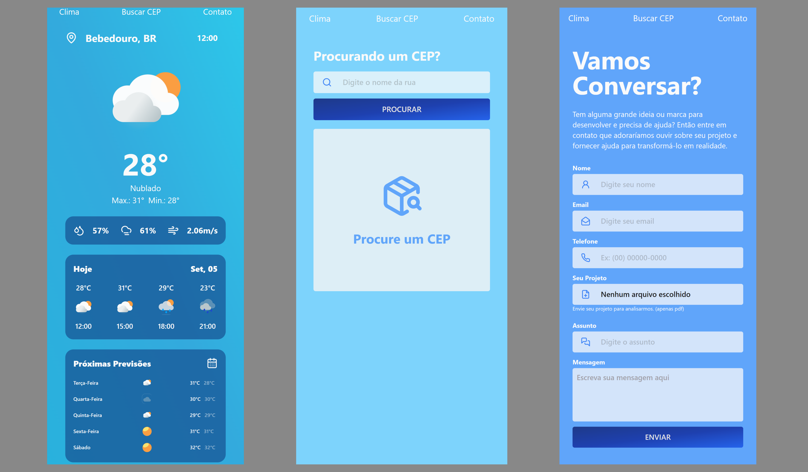

<p align="center">
  
</p>

<p align="center">
  

  

  
</p>

<h1 align="center">
    
</h1>

## 🧪 Technologies

This project was developed using the following technologies:

- [React](https://reactjs.org)
- [TypeScript](https://www.typescriptlang.org/)
- [NextJS](https://nextjs.org/)
- [TailwindCSS](https://tailwindcss.com/)
- [Shadcn/ui](https://ui.shadcn.com/)
- [Zod](https://zod.dev/)
- [React Hook Form](https://react-hook-form.com/)
- [Frame Motion](https://www.framer.com/motion/)

## 🚀 Getting started

Clone the project and access the folder.

```bash
$ git clone https://github.com/JeffyMesquita/frontend-test.git

$ cd frontend-test
```

Follow the steps below:

```bash
# Install the dependencies
$ npm install
# or
$ yarn install
# Start the project
$ npm run dev
# or
$ yarn dev
```

## 💻 Project

This project was developed for a test of a job vacancy.

## 🔖 Layout

I get inspiration from many layouts on [Figma](https://www.figma.com/), [Dribbble](https://dribbble.com/) and [Behance](https://www.behance.net/).

## 🌍 Deploy

You can access the project at the following link: [https://frontend-test.jeffymesquita.dev/](https://frontend-test.jeffymesquita.dev/)

## 💫 Social

You can follow me on some social networks:

- [Instagram](https://www.instagram.com/jeferson.mesquita/)
- [Linkedin](https://www.linkedin.com/in/jeffymesquita/)

## 🧑‍💻 Portfolio

You can see my portfolio at the following link: [https://jeffymesquita.dev/](https://jeffymesquita.dev/)

## 📝 License

This project is licensed under the MIT License. See the [LICENSE](LICENSE.md) file for details.

---

Made with :heartpulse: by [jeffymesquita](https://github.com/JeffyMesquita) 👋
